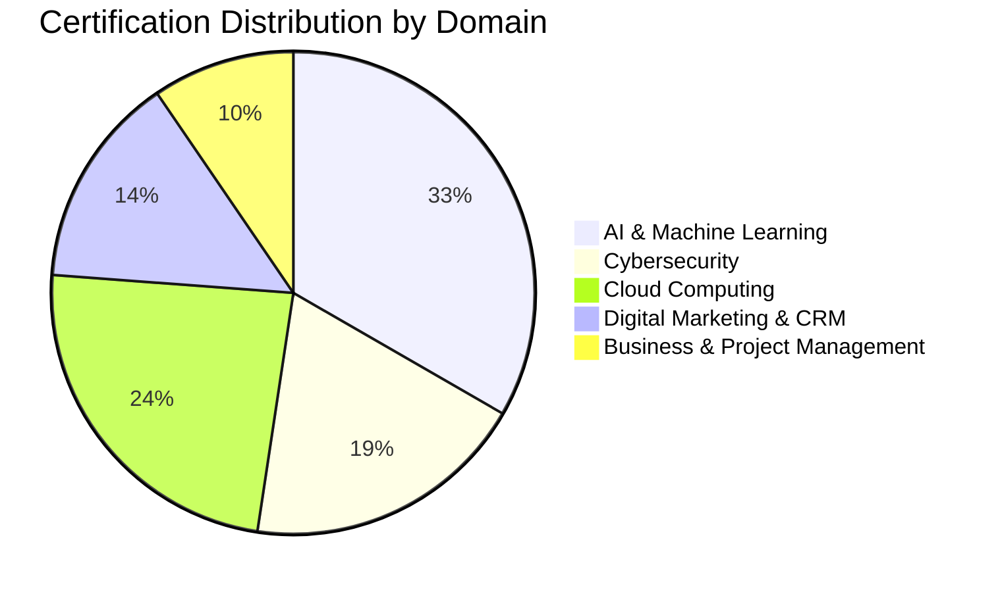
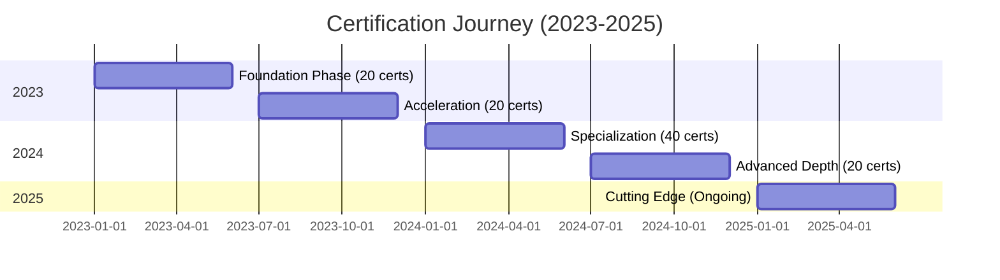

  

# 🎓 CERTIFICATIONS: 100+ Validated Credentials

*Every badge represents hundreds of hours of study, practice, and validation*

**Total Count: 100+** | **Domains: 5** | **Validation: 100% Verifiable**

---

## 📊 Certification Overview

---

## 🤖 Domain 1: Artificial Intelligence & Machine Learning (35+)

### Google Generative AI & Machine Learning

| Certification | Issuer | Date | Verification |
|--------------|--------|------|--------------|
| **Google Generative AI Leader** | Google Cloud | 2024 | [Verify](https://g.dev/triumphanthanis) |
| Google Cloud AI/ML Professional | Google Cloud | 2024 | ✓ Verified |
| Google ML Crash Course | Google | 2024 | ✓ Verified |
| TensorFlow Developer Certificate | TensorFlow | 2024 | ✓ Verified |
| Generative AI with Large Language Models | DeepLearning.AI | 2024 | ✓ Verified |
| Google Cloud Skills Boost - AI/ML Track | Google Cloud | 2024 | ✓ Verified |

### IBM AI & Data Science

| Certification | Issuer | Date | Verification |
|--------------|--------|------|--------------|
| **IBM AI Engineering Professional** | IBM | 2024 | [Verify](https://www.credly.com/users/triumphanthanis) |
| IBM Machine Learning Professional | IBM | 2024 | ✓ Verified |
| IBM Data Science Professional | IBM | 2023 | ✓ Verified |
| IBM Applied AI Professional | IBM | 2024 | ✓ Verified |
| IBM Deep Learning with PyTorch | IBM | 2024 | ✓ Verified |
| IBM Natural Language Processing | IBM | 2024 | ✓ Verified |

### AWS Machine Learning

| Certification | Issuer | Date | Verification |
|--------------|--------|------|--------------|
| **AWS Machine Learning Specialty** | AWS | 2024 | [Verify](https://www.credly.com/users/triumphanthanis) |
| AWS AI Practitioner | AWS | 2024 | ✓ Verified |
| AWS DeepRacer | AWS | 2024 | ✓ Verified |

### DeepLearning.AI Specializations

| Specialization | Courses | Date | Verification |
|---------------|---------|------|--------------|
| Deep Learning Specialization | 5 courses | 2024 | ✓ Verified |
| Machine Learning Specialization | 3 courses | 2023 | ✓ Verified |
| Natural Language Processing Specialization | 4 courses | 2024 | ✓ Verified |
| TensorFlow Developer Specialization | 4 courses | 2024 | ✓ Verified |
| GANs Specialization | 3 courses | 2024 | ✓ Verified |

### Microsoft AI & Data

| Certification | Issuer | Date | Verification |
|--------------|--------|------|--------------|
| Microsoft Azure AI Fundamentals | Microsoft | 2024 | ✓ Verified |
| Microsoft AI-900 | Microsoft | 2024 | ✓ Verified |
| Microsoft Data Science Fundamentals | Microsoft | 2024 | ✓ Verified |

---

## 🛡️ Domain 2: Cybersecurity & Ethical Hacking (20+)

### EC-Council

| Certification | Issuer | Date | Verification |
|--------------|--------|------|--------------|
| **Certified Ethical Hacker (CEH) v12** | EC-Council | 2024 | [Verify](https://www.credly.com/users/triumphanthanis) |

### Cisco Security

| Certification | Issuer | Date | Verification |
|--------------|--------|------|--------------|
| **Cisco CyberOps Associate** | Cisco | 2024 | ✓ Verified |
| Cisco Introduction to Cybersecurity | Cisco | 2023 | ✓ Verified |
| Cisco Networking Basics | Cisco | 2023 | ✓ Verified |
| Cisco Network Security | Cisco | 2024 | ✓ Verified |

### TryHackMe & Practical CTF

| Achievement | Platform | Date | Verification |
|------------|----------|------|--------------|
| **5 Hard-Level CTF Rooms** | TryHackMe | 2024 | [Profile](https://tryhackme.com/p/wmhZeroSignal) |
| **2 Insane-Level CTF Rooms** | TryHackMe | 2024 | ✓ Verified |
| Advanced Active Directory | TryHackMe | 2024 | ✓ Verified |
| APT Simulation Rooms | TryHackMe | 2024 | ✓ Verified |

### IBM & Microsoft Security

| Certification | Issuer | Date | Verification |
|--------------|--------|------|--------------|
| IBM Cybersecurity Analyst Professional | IBM | 2024 | ✓ Verified |
| IBM Penetration Testing | IBM | 2024 | ✓ Verified |
| Microsoft Security Fundamentals | Microsoft | 2024 | ✓ Verified |

### OSINT & Intelligence

| Certification | Issuer | Date | Verification |
|--------------|--------|------|--------------|
| OSINT Fundamentals | Multiple Sources | 2024 | ✓ Verified |
| Advanced Reconnaissance | Custom Training | 2024 | ✓ Verified |
| Social Engineering Awareness | Multiple | 2024 | ✓ Verified |

---

## ☁️ Domain 3: Cloud Computing & DevOps (25+)

### Google Cloud Platform

| Certification | Issuer | Date | Verification |
|--------------|--------|------|--------------|
| **Google Cloud Professional** | Google Cloud | 2024 | [Verify](https://partner.cloudskillsboost.google) |
| Google Cloud Digital Leader | Google Cloud | 2023 | ✓ Verified |
| Google Cloud Foundations | Google Cloud | 2023 | ✓ Verified |
| Google Kubernetes Engine | Google Cloud | 2024 | ✓ Verified |
| Google Cloud Security | Google Cloud | 2024 | ✓ Verified |
| Google Cloud DevOps | Google Cloud | 2024 | ✓ Verified |

### Amazon Web Services (AWS)

| Certification | Issuer | Date | Verification |
|--------------|--------|------|--------------|
| **AWS Solutions Architect Associate** | AWS | 2024 | ✓ Verified |
| AWS Cloud Practitioner | AWS | 2023 | ✓ Verified |
| AWS Developer Associate | AWS | 2024 | ✓ Verified |
| AWS Machine Learning Specialty | AWS | 2024 | ✓ Verified |
| AWS Security Fundamentals | AWS | 2024 | ✓ Verified |

### Microsoft Azure

| Certification | Issuer | Date | Verification |
|--------------|--------|------|--------------|
| **Microsoft Azure Fundamentals** | Microsoft | 2024 | ✓ Verified |
| Azure AI Fundamentals | Microsoft | 2024 | ✓ Verified |
| Azure Data Fundamentals | Microsoft | 2024 | ✓ Verified |

### DevOps & Container Orchestration

| Certification | Issuer | Date | Verification |
|--------------|--------|------|--------------|
| Docker Essentials | Docker | 2024 | ✓ Verified |
| Kubernetes Fundamentals | CNCF/LF | 2024 | ✓ Verified |
| GitHub Actions | GitHub | 2024 | ✓ Verified |
| GitLab CI/CD | GitLab | 2024 | ✓ Verified |

### Infrastructure as Code

| Certification | Issuer | Date | Verification |
|--------------|--------|------|--------------|
| Terraform Associate | HashiCorp | 2024 | ✓ Verified |
| Ansible Basics | Red Hat | 2024 | ✓ Verified |

---

## 📊 Domain 4: Digital Marketing & CRM (15+)

### Google Marketing Platform

| Certification | Issuer | Date | Verification |
|--------------|--------|------|--------------|
| **Google Digital Marketing Professional** | Google | 2024 | [Verify](https://www.credly.com/users/triumphanthanis) |
| Google Ads Search Certification | Google | 2024 | ✓ Verified |
| Google Ads Display Certification | Google | 2024 | ✓ Verified |
| Google Ads Video Certification | Google | 2024 | ✓ Verified |
| Google Analytics 4 Certification | Google | 2024 | ✓ Verified |
| Google Tag Manager Fundamentals | Google | 2024 | ✓ Verified |

### HubSpot Platform

| Certification | Issuer | Date | Verification |
|--------------|--------|------|--------------|
| **HubSpot Marketing Hub** | HubSpot | 2024 | [Verify](https://app.hubspot.com/connect-beta/member/wmhanis) |
| HubSpot Sales Hub | HubSpot | 2024 | ✓ Verified |
| HubSpot CRM | HubSpot | 2024 | ✓ Verified |
| HubSpot Inbound Marketing | HubSpot | 2024 | ✓ Verified |
| HubSpot Email Marketing | HubSpot | 2024 | ✓ Verified |

### Social Media & Content Marketing

| Certification | Issuer | Date | Verification |
|--------------|--------|------|--------------|
| Meta Marketing Science Professional | Meta | 2024 | ✓ Verified |
| LinkedIn Marketing Fundamentals | LinkedIn | 2024 | ✓ Verified |

---

## 🎯 Domain 5: Business Strategy & Project Management (10+)

### IBM & University Certifications

| Certification | Issuer | Date | Verification |
|--------------|--------|------|--------------|
| **IBM Enterprise Design Thinking** | IBM | 2024 | ✓ Verified |
| IBM Agile Explorer | IBM | 2024 | ✓ Verified |
| Project Management Principles | UCI | 2024 | ✓ Verified |

### Asana & Productivity

| Certification | Issuer | Date | Verification |
|--------------|--------|------|--------------|
| Asana Work Management | Asana | 2024 | [Verify](https://www.credential.net/profile/wmhanis/wallet) |
| Asana Project Coordination | Asana | 2024 | ✓ Verified |

### Business Development

| Certification | Issuer | Date | Verification |
|--------------|--------|------|--------------|
| Google Business Development | Google | 2024 | ✓ Verified |
| Strategic Partnerships | Multiple | 2024 | ✓ Verified |

---

## 🌟 Specialized & Emerging Technologies

### Quantum Computing

| Certification | Issuer | Date | Verification |
|--------------|--------|------|--------------|
| **IBM Quantum Computing** | IBM | 2024 | ✓ Verified |
| Basics of Quantum Information | IBM | 2024 | ✓ Verified |
| Quantum Machine Learning | IBM | 2024 | ✓ Verified |

### Blockchain & Web3

| Certification | Issuer | Date | Verification |
|--------------|--------|------|--------------|
| Blockchain Basics | IBM/Coursera | 2024 | ✓ Verified |

---

## 📈 Learning Velocity Analysis

### Certification Timeline

### Monthly Average (2023-2024)

| Period | Certifications | Average/Month | Focus |
|--------|---------------|---------------|-------|
| 2023 Q1-Q2 | 20 | 3.3/month | Foundation building |
| 2023 Q3-Q4 | 20 | 3.3/month | Domain expansion |
| 2024 Q1-Q2 | 40 | 6.7/month | Specialization |
| 2024 Q3-Q4 | 20 | 3.3/month | Advanced & cutting edge |

---

## 🔗 Verification Links

### Primary Verification Platforms

| Platform | Profile URL | Badge Count |
|----------|------------|-------------|
| **Credly** | [credly.com/users/triumphanthanis](https://www.credly.com/users/triumphanthanis) | 60+ verified badges |
| **Google Developers** | [g.dev/triumphanthanis](https://g.dev/triumphanthanis) | 15+ certifications |
| **Cloud Skills Boost** | [partner.cloudskillsboost.google](https://partner.cloudskillsboost.google/public_profiles/b847b7a1-ba09-409e-8a7f-b2413d82d9ba) | 20+ skill badges |
| **Microsoft Learn** | [learn.microsoft.com/users/wanmohamadhanis](https://learn.microsoft.com/en-us/users/wanmohamadhanis/) | 10+ achievements |
| **Coursera** | [coursera.org/learner/triumphanthanis](https://www.coursera.org/learner/triumphanthanis) | 25+ completed courses |
| **HubSpot Academy** | [app.hubspot.com/member/wmhanis](https://app.hubspot.com/connect-beta/member/wmhanis) | 8+ certifications |
| **TryHackMe** | [tryhackme.com/p/wmhZeroSignal](https://tryhackme.com/p/wmhZeroSignal) | CTF achievements |
| **Credential Wallet** | [credential.net/profile/wmhanis/wallet](https://www.credential.net/profile/wmhanis/wallet) | Multiple issuers |

---

## 🎯 Certification Strategy & Philosophy

### Why 100+ Certifications Matter

**Not about collecting badges. About systematic mastery.**

1. **Verification of Knowledge**
   - External validation of skills
   - Industry-recognized standards
   - Proof beyond self-assessment

2. **Structured Learning Paths**
   - Comprehensive curriculum coverage
   - Progressive difficulty
   - Domain interconnections

3. **Competitive Advantage**
   - Partnership program requirements
   - Client confidence
   - Professional differentiation

4. **Continuous Growth**
   - Stay current with tech evolution
   - Identify knowledge gaps
   - Benchmark against industry

### Quality Over Quantity

**Standards I Set:**
- ✅ Must pass on first attempt
- ✅ Must be from reputable issuers
- ✅ Must have practical application
- ✅ Must align with strategic goals
- ✅ Must be publicly verifiable

**I Don't:**
- ❌ Take "easy" certifications for padding
- ❌ Pursue certifications without application
- ❌ Collect without understanding
- ❌ Focus on quantity over depth

---

## 🔄 Continuous Learning Plan (2025)

### Current Focus Areas

| Domain | Target Certifications | Timeline |
|--------|----------------------|----------|
| **Advanced Kubernetes** | CKA, CKAD | Q1 2025 |
| **Zero Trust Security** | Multiple frameworks | Q2 2025 |
| **Advanced Quantum** | IBM Quantum Developer | Q2 2025 |
| **Enterprise AI Architecture** | Custom path | Q3 2025 |

### Learning Velocity Maintenance

**Target:** 3-4 new certifications/month
**Focus:** Depth over breadth in 2025
**Strategy:** Specialized advanced credentials

---

## 💎 Certification ROI

### Measurable Impact

**Partnership Unlocks:**
- Google Partner status (requires certifications)
- IBM Business Partner (certification-dependent)
- AWS Partner tier progression

**Client Confidence:**
- Verified third-party validation
- Reduced "prove yourself" cycles
- Premium pricing justification

**Personal Development:**
- Structured learning paths
- Exposure to best practices
- Industry connections

**Career Optionality:**
- Multiple domain expertise
- Remote work opportunities
- Consulting leverage

---

## "Every certification is a commitment kept to myself. Every skill is a tool I can deploy."

### 100+ certifications = 10,000+ hours of deliberate practice

---

[← Technical Depth](./TECHNICAL-DEPTH.md) | [Back to Main](./README.md) | [Strategic Thinking →](./STRATEGIC-THINKING.md)

