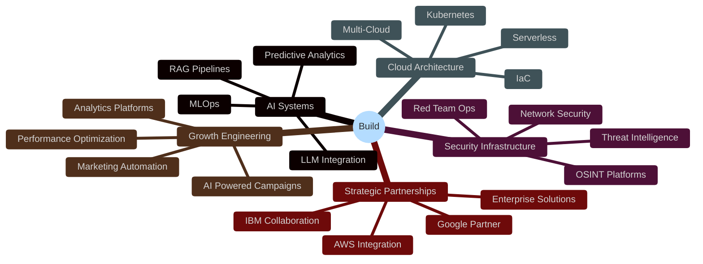

  

---

### 👤 Who Am I?

I'm <strong style="color: #667eea;">Hanis</strong> — a transdisciplinary strategist who operates where <strong style="color: #667eea;">AI</strong>, <strong style="color: #ff6b6b;">cybersecurity</strong>, <strong style="color: #f093fb;">digital marketing</strong>, and <strong style="color: #43e97b;">business intelligence</strong> converge.

I don't operate in silos. I see the throughlines. I take complex systems, decode the chaos, and turn them into frameworks that actually move the needle.

---

## 
🎯 Quick Navigation

<table>
<tr>
<td align="center" width="25%">

### 📖

### **[The Story](./PERSONA.md)**

The transformation from adversity to mastery

"Forged by fire, defined by design"

</td>
<td align="center" width="25%">

### 🗺️

### **[The Journey](./TIMELINE.md)**

Visual timeline with Mermaid diagrams

Construction → E-commerce → Tech

</td>
<td align="center" width="25%">

### ⚔️

### **[The Arsenal](./TECHNICAL-DEPTH.md)**

100+ certifications & technical mastery

CEH v12 | Google AI | AWS | IBM

</td>
<td align="center" width="25%">

### 🧠

### **[The Mind](./STRATEGIC-THINKING.md)**

How I play chess in a poker world

Frameworks & Problem-Solving

</td>
</tr>
</table>

---

## 📊 Current Stats

---

## 
💎 What Makes This Different

<table style="width: 100%; border-collapse: separate; border-spacing: 20px;">
<tr>
<td width="33%" style="vertical-align: top;">
  

    

      
🧩

      <h3 style="color: #667eea; font-weight: 900; font-size: 20px; margin: 12px 0;">Transdisciplinary Fusion</h3>
      
Not a specialist. Not a generalist. A <strong style="color: #667eea;">synthesis engineer</strong> who connects AI, security, cloud, and business into <em style="color: #c9d1d9;">frameworks that actually work</em>.

    

    

      ● ACTIVE
    

  

</td>
<td width="33%" style="vertical-align: top;">
  

    

      
⚡

      <h3 style="color: #f093fb; font-weight: 900; font-size: 20px; margin: 12px 0;">Execution Velocity</h3>
      
While others debate, I <strong style="color: #f093fb;">build and ship</strong>. Speed without chaos. Precision without paralysis. <em style="color: #c9d1d9;">100+ certifications</em> earned through relentless iteration.

    

    

      ● ALWAYS ON
    

  

</td>
<td width="33%" style="vertical-align: top;">
  

    

      
🎯

      <h3 style="color: #ff6b6b; font-weight: 900; font-size: 20px; margin: 12px 0;">Zero-BS Principle</h3>
      
<strong style="color: #ff6b6b;">No fluff. No filler.</strong> Every line of code has a purpose. Every framework solves a problem. Every cert <em style="color: #c9d1d9;">earns its place</em> or gets removed.

    

    

      ● VERIFIED
    

  

</td>
</tr>
</table>

  <h4 style="color: #667eea; font-weight: 900; font-size: 16px; margin: 0 0 16px 0; text-transform: uppercase; letter-spacing: 0.1em;">📊 Impact Metrics</h4>
  

    

      
100+

      
Global Certifications

    

    

      
5

      
Domain Mastery

    

    

      
3

      
Strategic Partners

    

    

      
∞

      
Learning Mode

    

  

---

## 
🎓 Credentials Snapshot

<table>
<tr>
<th align="left" width="15%">Domain</th>
<th align="left" width="40%">Key Certifications</th>
<th align="center" width="15%">Count</th>
<th align="center" width="30%">Progress</th>
</tr>
<tr><td colspan="4">
</td></tr>
<tr>
<td align="left">
  

    <strong style="color: #667eea;">🤖 AI/ML</strong>
  

</td>
<td align="left">Google Gen AI Leader, IBM AI/ML, AWS ML</td>
<td align="center">35+</td>
<td align="center"></td>
</tr>
<tr>
<td align="left">
  

    <strong style="color: #ff6b6b;">🔐 Security</strong>
  

</td>
<td align="left">CEH v12, TryHackMe CTF, Cisco Security</td>
<td align="center">20+</td>
<td align="center"></td>
</tr>
<tr>
<td align="left">
  

    <strong style="color: #4facfe;">☁️ Cloud</strong>
  

</td>
<td align="left">Google Cloud Professional, AWS Partner, Azure</td>
<td align="center">25+</td>
<td align="center"></td>
</tr>
<tr>
<td align="left">
  

    <strong style="color: #f093fb;">📈 Marketing</strong>
  

</td>
<td align="left">Google DM Professional, HubSpot CRM</td>
<td align="center">15+</td>
<td align="center"></td>
</tr>
<tr>
<td align="left">
  

    <strong style="color: #43e97b;">📊 Business</strong>
  

</td>
<td align="left">IBM Design Thinking, Agile, Project Management</td>
<td align="center">10+</td>
<td align="center"></td>
</tr>
</table>

 

<strong style="background: linear-gradient(90deg, #667eea, #f093fb); -webkit-background-clip: text; -webkit-text-fill-color: transparent; background-clip: text; font-size: 18px;">Total:</strong> 100+ globally recognized certifications | <strong><a href="./CERTIFICATIONS.md" style="color: #667eea; text-decoration: none; transition: all 0.3s ease;">View All →</a></strong>

 

---

## 🏗️ What I Build

---

## 
🌟 Philosophy

<blockquote style="border-left: 4px solid #f093fb; padding-left: 24px; margin: 0 0 24px 0; color: #c9d1d9; font-size: 17px; line-height: 1.8; font-style: italic; font-weight: 500;">
<strong style="background: linear-gradient(90deg, #f093fb, #667eea); -webkit-background-clip: text; -webkit-text-fill-color: transparent; background-clip: text; font-size: 18px;">"I had to reverse-engineer my own obstacles — forced to play chess in a world built for poker, translating complexity into clarity, building capital with no currency, and making my own table when I wasn't offered a seat."</strong>
</blockquote>

<h3 style="background: linear-gradient(90deg, #667eea, #43e97b); -webkit-background-clip: text; -webkit-text-fill-color: transparent; background-clip: text; font-weight: 900; font-size: 22px; margin: 24px 0 20px 0;">Operating Principles</h3>

<table style="width: 100%; border-collapse: separate; border-spacing: 0 12px;">
<tr>
<td>
  

    ⏰
    <strong style="color: #667eea; font-size: 15px;">Time is Currency</strong>
    — I protect it relentlessly
  

</td>
</tr>
<tr>
<td>
  

    🎯
    <strong style="color: #ff6b6b; font-size: 15px;">Precision as Mindset</strong>
    — Not just a practice, a way of being
  

</td>
</tr>
<tr>
<td>
  

    📋
    <strong style="color: #4facfe; font-size: 15px;">Instructions as Contracts</strong>
    — I don't make assumptions
  

</td>
</tr>
<tr>
<td>
  

    🔄
    <strong style="color: #f093fb; font-size: 15px;">Continuous Evolution</strong>
    — Every scar refines the approach
  

</td>
</tr>
<tr>
<td>
  

    🤝
    <strong style="color: #43e97b; font-size: 15px;">Shared Accountability</strong>
    — High standards start with me
  

</td>
</tr>
</table>

---

## 🔥 GitHub Activity

---

## 🐍 Contribution Snake

---

## 🏆 Trophy Case

---

## 
🤝 Let's Connect

Open to collaborations where <strong style="color: #43e97b;">innovation</strong>, <strong style="color: #4facfe;">integrity</strong>, and <strong style="color: #667eea;">meaningful impact</strong> converge.

---

<h3 style="background: linear-gradient(90deg, #f093fb, #667eea); -webkit-background-clip: text; -webkit-text-fill-color: transparent; background-clip: text; font-weight: 900; font-size: 24px; margin-bottom: 20px;">🎭 The Journey Continues</h3>

"I'm not polished. But I'm real. I've been through the fire — and came out quieter, clearer, and more intentional."

If you're building something that truly matters, I'm the one you want beside you in the storm.

Built with precision. Forged by adversity. Driven by purpose.

 

<h3 style="background: linear-gradient(90deg, #ff6b6b, #667eea); -webkit-background-clip: text; -webkit-text-fill-color: transparent; background-clip: text; font-weight: 900; font-size: 20px; margin-bottom: 16px;">🔐 Security Notice</h3>

This profile is actively monitored. All interactions are logged. 
Mediocrity is automatically filtered. Excellence is amplified.

<table style="margin: 20px auto; text-align: left; max-width: 500px;">
<tr>
<td style="padding: 8px 0;">
  <strong style="color: #667eea;">⚡ Powered by:</strong>
</td>
<td style="padding: 8px 0;">
  Discipline × Curiosity × Relentless Execution
</td>
</tr>
<tr>
<td style="padding: 8px 0;">
  <strong style="color: #43e97b;">🎯 Mission:</strong>
</td>
<td style="padding: 8px 0;">
  Build. Iterate. Impact. Repeat.
</td>
</tr>
<tr>
<td style="padding: 8px 0;">
  <strong style="color: #f093fb;">💀 Mode:</strong>
</td>
<td style="padding: 8px 0;">
  <code style="background: rgba(240, 147, 251, 0.2); padding: 4px 8px; border-radius: 4px; color: #f093fb; font-weight: 700;">ALWAYS_ON</code>
</td>
</tr>
</table>

