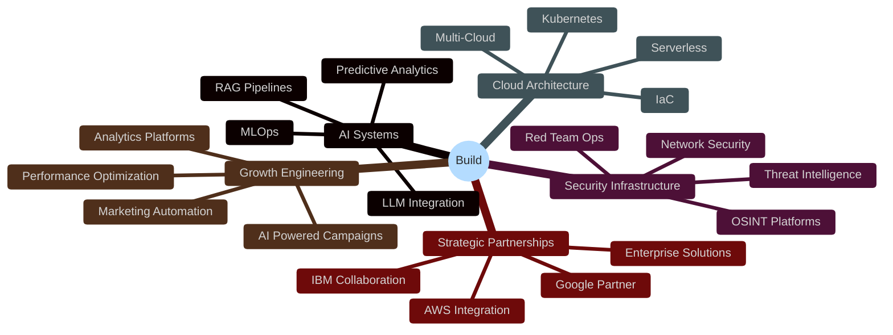

<div align="center">
  
</div>

<div align="center">

[](https://git.io/typing-svg)

</div>

---

<div align="center">

### 👤 Who Am I?

I'm **Hanis** — a transdisciplinary strategist who operates where **AI**, **cybersecurity**, **digital marketing**, and **business intelligence** converge.

I don't operate in silos. I see the throughlines. I take complex systems, decode the chaos, and turn them into frameworks that actually move the needle.

</div>

---

## 🎯 Quick Navigation

<table>
<tr>
<td align="center" width="25%">

### 📖 [The Story](./PERSONA.md)

The transformation from adversity to mastery

*"Forged by fire, defined by design"*

</td>
<td align="center" width="25%">

### 🗺️ [The Journey](./TIMELINE.md)

Visual timeline with Mermaid diagrams

*Construction → E-commerce → Tech*

</td>
<td align="center" width="25%">

### ⚔️ [The Arsenal](./TECHNICAL-DEPTH.md)

100+ certifications & technical mastery

*CEH v12 | Google AI | AWS | IBM*

</td>
<td align="center" width="25%">

### 🧠 [The Mind](./STRATEGIC-THINKING.md)

How I play chess in a poker world

*Frameworks & Problem-Solving*

</td>
</tr>
</table>

---

## 📊 Current Stats

<div align="center">


</div>

---

## 🎓 Credentials Snapshot

<div align="center">

| Domain | Key Certifications | Count | Progress |
|--------|-------------------|-------|----------|
| 🤖 **AI/ML** | Google Gen AI Leader, IBM AI/ML, AWS ML | 35+ |  |
| 🔐 **Cybersecurity** | CEH v12, TryHackMe CTF, Cisco Security | 20+ |  |
| ☁️ **Cloud** | Google Cloud Professional, AWS Partner, Azure | 25+ |  |
| 📈 **Digital Marketing** | Google DM Professional, HubSpot CRM | 15+ |  |
| 📊 **Business** | IBM Design Thinking, Agile, Project Management | 10+ |  |

**Total:** 100+ globally recognized certifications | **[View All →](./CERTIFICATIONS.md)**

<br/>


</div>

---

## 🏗️ What I Build

<div align="center">



</div>

---

## 🌟 Philosophy

> **"I had to reverse-engineer my own obstacles — forced to play chess in a world built for poker, translating complexity into clarity, building capital with no currency, and making my own table when I wasn't offered a seat."**

### Operating Principles

- ⏰ **Time is Currency** — I protect it relentlessly
- 🎯 **Precision as Mindset** — Not just a practice, a way of being
- 📋 **Instructions as Contracts** — I don't make assumptions
- 🔄 **Continuous Evolution** — Every scar refines the approach
- 🤝 **Shared Accountability** — High standards start with me

---

## 🔥 GitHub Activity

<div align="center">


</div>

---

## 🐍 Contribution Snake

<div align="center">


</div>

---

## 🏆 Trophy Case

<div align="center">


</div>

---

## 🤝 Let's Connect

<div align="center">

Open to collaborations where **innovation**, **integrity**, and **meaningful impact** converge.

[](https://wanmohamadhanis.my.canva.site/wmh-portfolio)
[](https://linkedin.com/in/wanmohamadhanis)
[](https://github.com/novusaevum)
[](mailto:wmh.dirc@gmail.com)

</div>

---

<div align="center">

### 🎭 The Journey Continues

*"I'm not polished. But I'm real. I've been through the fire — and came out quieter, clearer, and more intentional."*

**If you're building something that truly matters, I'm the one you want beside you in the storm.**

---

<sub>Built with precision. Forged by adversity. Driven by purpose.</sub>


</div>


<div align="center">

### 🔐 Security Notice
```
This profile is actively monitored. All interactions are logged.
Mediocrity is automatically filtered. Excellence is amplified.
```

**⚡ Powered by:** Discipline × Curiosity × Relentless Execution  
**🎯 Mission:** Build. Iterate. Impact. Repeat.  
**💀 Mode:** `ALWAYS_ON`

</div>
