# 🧠 STRATEGIC THINKING: How I Approach Problems

<div align="center">

## From Chaos to Clarity: The Strategic Framework

*"I don't just solve problems. I redesign the game."*

</div>

---

## 🎯 The Core Philosophy

### Three Principles That Guide Everything

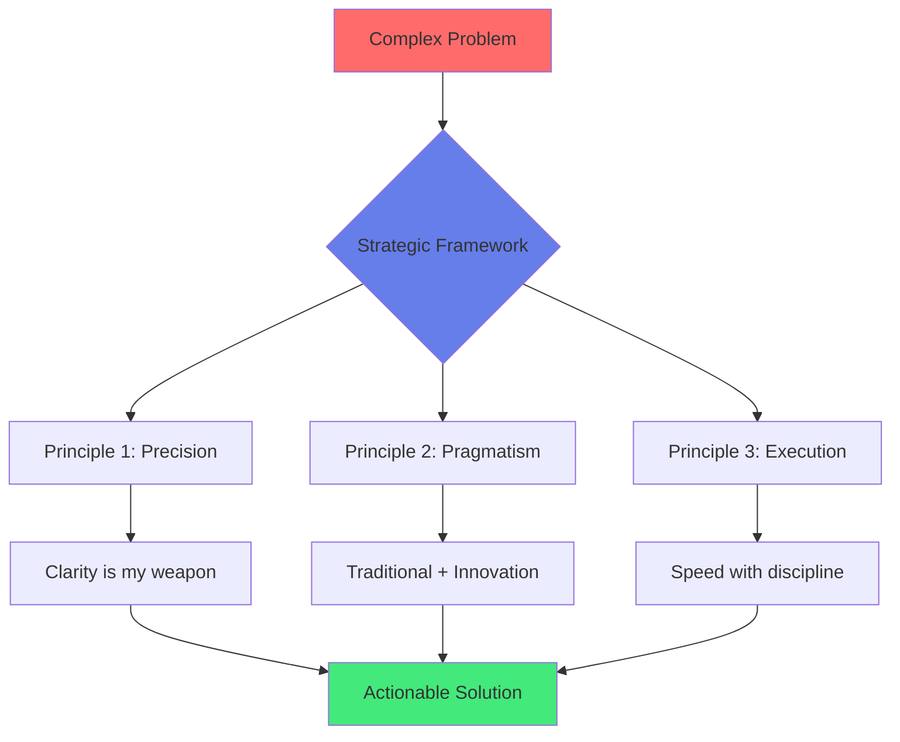

**Principle 1: Precision Over Perfection**
- Cut through ambiguity
- No surface-level answers
- Every word earns its place
- Zero tolerance for fluff

**Principle 2: Pragmatic Innovation**
- Respect proven methods
- Welcome disruptive ideas
- Fuse traditional business with emerging tech
- "What works" > "What's trendy"

**Principle 3: Disciplined Execution**
- Strategy without execution is daydreaming
- Fast iteration > slow perfection
- Measure everything
- Adapt based on data

---

## 🧩 Problem-Solving Framework

### The 5D Method

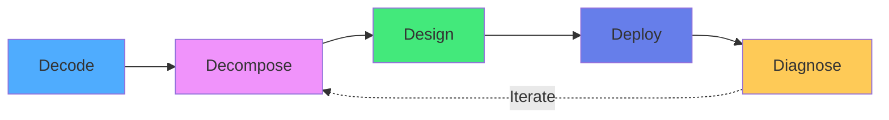

#### Phase 1: DECODE

**What's really being asked?**

Most problems are mis-stated. I dig until I find the real question.

```
Surface Question: "Why is our marketing not working?"

Real Question After Decoding:
├─ Are we targeting the right audience?
├─ Is the message resonating?
├─ Are we in the right channels?
├─ Is attribution tracking correct?
└─ Do we have a conversion problem or an acquisition problem?
```

**Tools Used:**
- 5 Whys technique
- First principles thinking
- Stakeholder interviews
- Data audit

#### Phase 2: DECOMPOSE

**Break complexity into manageable parts**

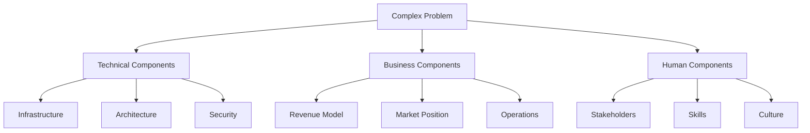

**Example: E-commerce Platform Rebuild**

```
Problem: "Our platform is slow and losing customers"

Decomposition:
1. Technical:
   - Database queries inefficient
   - No CDN for assets
   - Monolithic architecture
   
2. Business:
   - Cart abandonment at 78%
   - Competitor offers faster checkout
   - Mobile experience broken
   
3. Human:
   - Dev team lacks cloud expertise
   - No DevOps practices
   - Siloed teams
```

#### Phase 3: DESIGN

**Architect the solution with constraints in mind**

**Multi-Angle Analysis:**

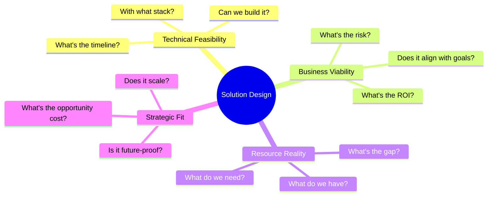

**Design Principles:**
- Start with the end in mind
- Design for 10x scale, build for 1x
- Prioritize ruthlessly (Pareto principle)
- Build optionality, not rigidity

#### Phase 4: DEPLOY

**Execute with speed and discipline**

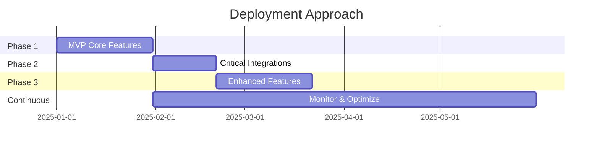

**Deployment Philosophy:**
- Ship imperfect but functional
- Get feedback early
- Iterate based on real usage
- Perfect is the enemy of shipped

**Risk Mitigation:**
- Feature flags for controlled rollout
- A/B testing for validation
- Monitoring from day one
- Rollback plans always ready

#### Phase 5: DIAGNOSE

**Measure, learn, adapt**

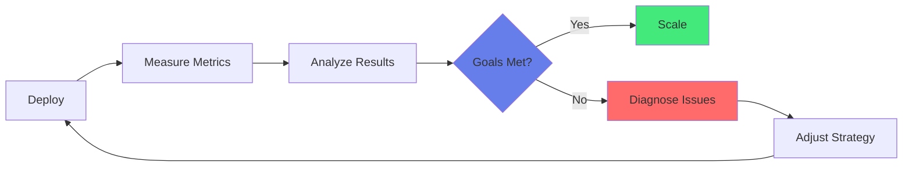

**What I Track:**
- Business metrics (revenue, conversion, retention)
- Technical metrics (latency, uptime, errors)
- User metrics (engagement, satisfaction, behavior)
- Team metrics (velocity, quality, morale)

---

## 🎲 Decision-Making Framework

### The Decision Matrix

**For Every Major Decision:**

| Factor | Weight | Score (1-10) | Weighted Score |
|--------|--------|--------------|----------------|
| **Strategic Alignment** | 30% | ? | ? |
| **ROI Potential** | 25% | ? | ? |
| **Execution Feasibility** | 20% | ? | ? |
| **Risk Level** | 15% | ? | ? |
| **Time to Value** | 10% | ? | ? |

**Decision Types:**

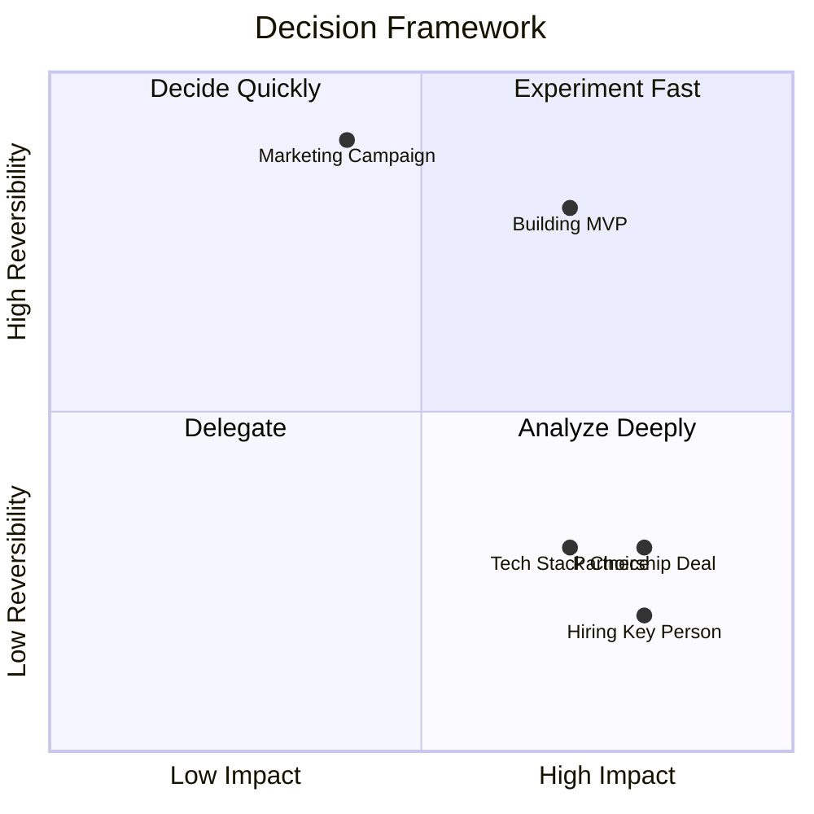

**Type 1 Decisions (Irreversible):**
- Analyze deeply
- Seek multiple perspectives
- Take time if needed
- Examples: Co-founder, tech architecture, pivots

**Type 2 Decisions (Reversible):**
- Decide fast
- Learn from outcome
- Course-correct quickly
- Examples: Marketing tests, feature experiments, pricing

---

## 🔄 Strategic Patterns I Use

### Pattern 1: Constraint-Based Innovation

**"Scarcity breeds creativity"**

When I had no company to back my tech partnerships:
1. Leveraged personal certifications as proof
2. Built public portfolio to demonstrate value
3. Used API access to create immediate value
4. Executed small to prove capability

**Result:** Google, IBM, AWS partnerships as an individual.

### Pattern 2: Multi-Domain Synthesis

**"The best insights live at intersections"**

Example: AI-Powered Marketing System
- **AI/ML** provides predictive capabilities
- **Cloud** enables scale and speed
- **Marketing** delivers business value
- **Security** ensures compliance

### Pattern 3: Parallel Path Pursuit

**"Don't wait for perfect information"**

When pivoting from e-commerce to tech (2023):
- **Path A:** Building technical skills (certifications)
- **Path B:** Documenting journey (GitHub, content)
- **Path C:** Networking (partnerships, communities)
- **Path D:** Experimenting (projects, MVPs)

All happening simultaneously. Not sequentially.

### Pattern 4: Evidence-Based Adaptation

**"Strong opinions, loosely held"**

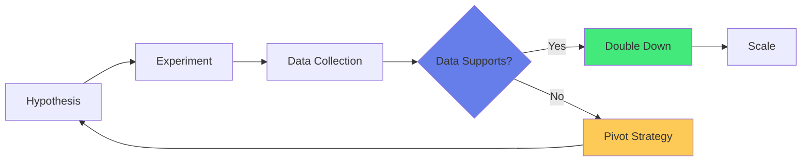

I form strong hypotheses, but I let data override my intuition.

---

## 🎯 Case Study: The 2023 Pivot

### Context

**The Crisis:**
- E-commerce business hit by DOS attack
- Relationship breakdown with partner
- Financial reset required
- At a crossroads: Continue or pivot?

### Strategic Analysis

**Traditional Approach:**
- Rebuild the business
- Find new partner
- Return to status quo

**My Approach: Strategic Recalibration**

**Step 1: DECODE**
- What did the crisis reveal?
- Where were the vulnerabilities?
- What did I actually enjoy?
- Where is the market moving?

**Insights:**
- Technical knowledge gap cost me (couldn't defend against DOS)
- Dependence on single channel/partner was fragile
- E-commerce was commoditizing rapidly
- Technology skills had higher ceiling

**Step 2: DECOMPOSE**

```
Components to Consider:
├─ Financial: How long can I invest in transition?
├─ Skills: What do I already have? What's missing?
├─ Market: Where is opportunity? What's the gap?
└─ Psychology: Can I sustain this? What motivates me?
```

**Step 3: DESIGN**

**The Plan:**
- Aggressive upskilling (100+ certifications in 2 years)
- Build portfolio through projects
- Document journey publicly
- Target strategic partnerships early
- Monetize through consulting while building

**Step 4: DEPLOY**

**Execution Timeline:**
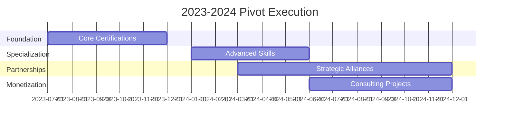

**Step 5: DIAGNOSE**

**Results After 18 Months:**
- ✅ 100+ certifications achieved
- ✅ Partnerships with Google, IBM, AWS secured
- ✅ Portfolio of projects deployed
- ✅ Consulting revenue established
- ✅ Technical depth in 5 domains validated

**ROI:** From crisis to capability in 18 months.

---

## 🧭 Strategic Positioning Framework

### How I Position Myself

**The Unique Value Proposition:**

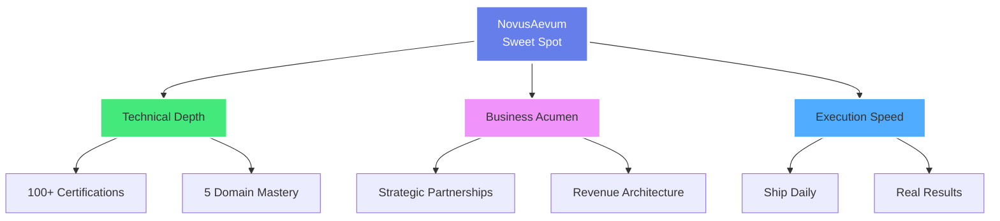

**Most people have:**
- Technical skills OR business skills
- Deep expertise OR broad knowledge
- Strategic thinking OR execution capability

**I built all three intentionally.**

### The Positioning Statement

> "I operate at the intersection of AI, cloud, cybersecurity, and business strategy — not as a generalist, but as a transdisciplinary expert who builds solutions that matter."

**What This Means:**
- I'm not a jack-of-all-trades
- Each domain has depth (verified by certs)
- The value is in the intersections
- I execute, not just advise

---

## 🎲 Risk Management Philosophy

### How I Think About Risk

**Not:** "How do I avoid all risks?"
**But:** "Which risks are worth taking?"

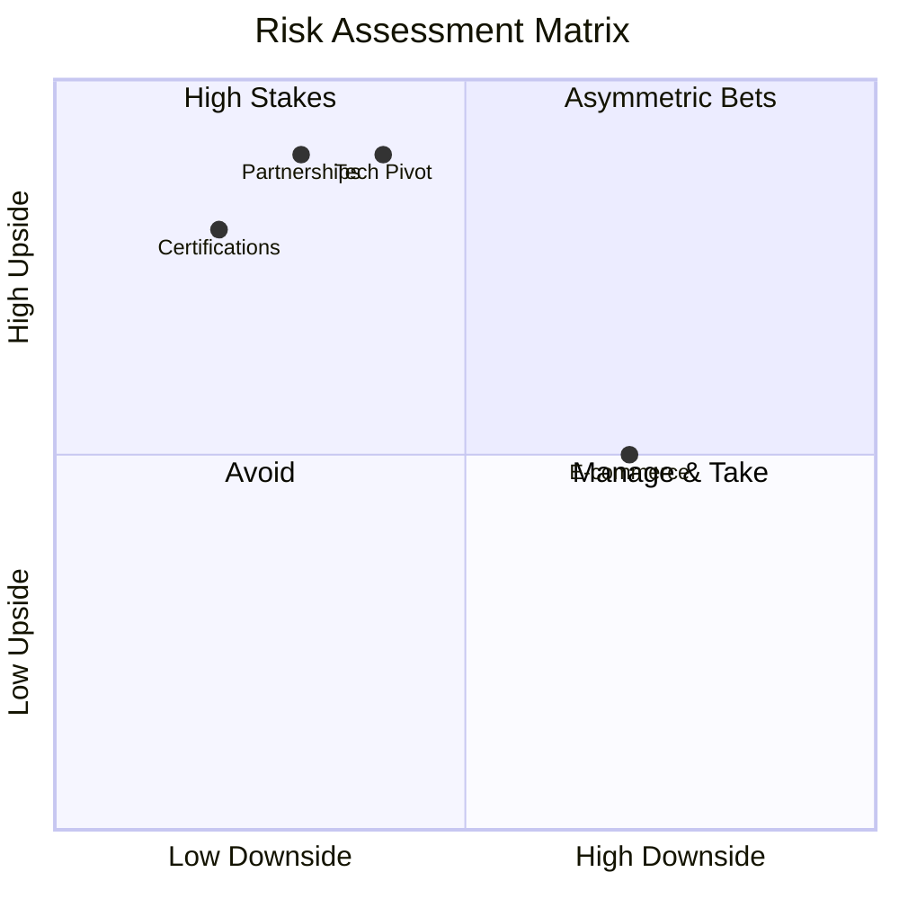

**Asymmetric Bets (Low Downside, High Upside):**
- Certifications (time investment, high credibility return)
- Public portfolio (effort invested, visibility gained)
- Content creation (hours spent, authority built)

**These are my favorite plays.**

---

## 💡 Mental Models I Use Daily

### Model 1: Inversion

Instead of "How do I succeed?", I ask:
- "What guarantees failure?"
- Then avoid those paths

### Model 2: Second-Order Thinking

Always ask: "And then what?"
- What are the consequences of the consequences?
- What's the ripple effect?

### Model 3: Opportunity Cost

Every "yes" is a "no" to something else.
- What am I NOT doing by choosing this?
- Is this the highest-value use of my time?

### Model 4: Compounding

Small improvements compound.
- 1% better daily = 37x better yearly
- Consistency beats intensity

---

## 🎯 Strategic Frameworks in Action

### Example 1: Building Without Credentials

**Challenge:** How do you get tech partnerships without a company?

**Framework Application:**

**DECODE:**
- What do tech companies actually want?
- Answer: Validated expertise + value creation

**DESIGN:**
- Earn certifications (validation)
- Build public projects (proof)
- Use their platforms (value creation)
- Document the journey (thought leadership)

**DEPLOY:**
- Systematically earned 100+ certs
- Published projects on GitHub
- Created content demonstrating expertise

**RESULT:**
- Google, IBM, AWS partnerships as individual

### Example 2: Multi-Cloud Strategy

**Challenge:** Which cloud provider to specialize in?

**Framework Application:**

**DECODE:**
- Real question: Do I need to choose?
- Answer: No — multi-cloud is the future

**DESIGN:**
- Master fundamentals (transferable)
- Get certified in all three (GCP, AWS, Azure)
- Build cross-cloud expertise
- Position as multi-cloud architect

**RESULT:**
- Flexibility to work with any client
- Higher value as translator between clouds
- More partnership opportunities

---

## 🔮 Future-Thinking: 2025 and Beyond

### Strategic Bets I'm Making

**1. AI Will Commoditize, Integration Will Matter**
- Everyone will have access to powerful AI
- The value will be in connecting AI to real workflows
- I'm building that integration expertise

**2. Multi-Domain Expertise Will Beat Deep Specialists**
- Problems don't respect domain boundaries
- Solutions require multi-disciplinary thinking
- I'm positioned at the intersections

**3. Individual Leverage Will Increase**
- Technology enables one-person businesses at scale
- Personal brand > company brand
- I'm building both technical and brand leverage

### What I'm Building Towards

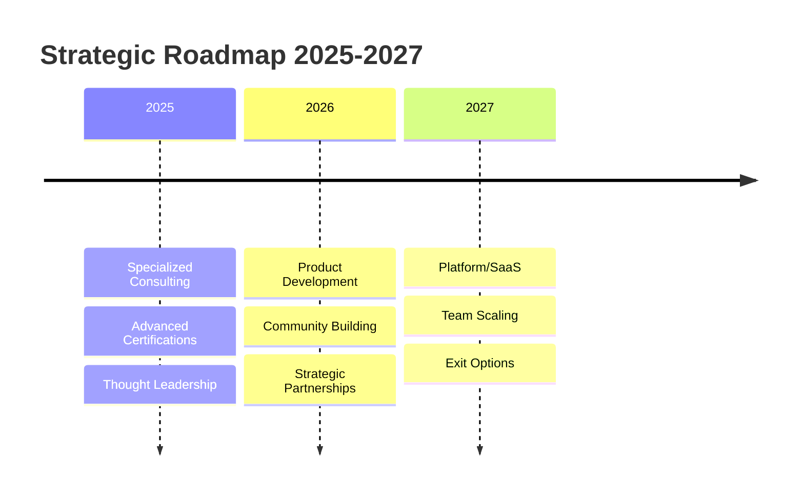

---

<div align="center">

## "Strategy without execution is hallucination. Execution without strategy is exhaustion."

### I do both.

---

[← Certifications](./CERTIFICATIONS.md) | [Back to Main](./README.md) | [Contact Me →](./README.md#contact)

</div>
