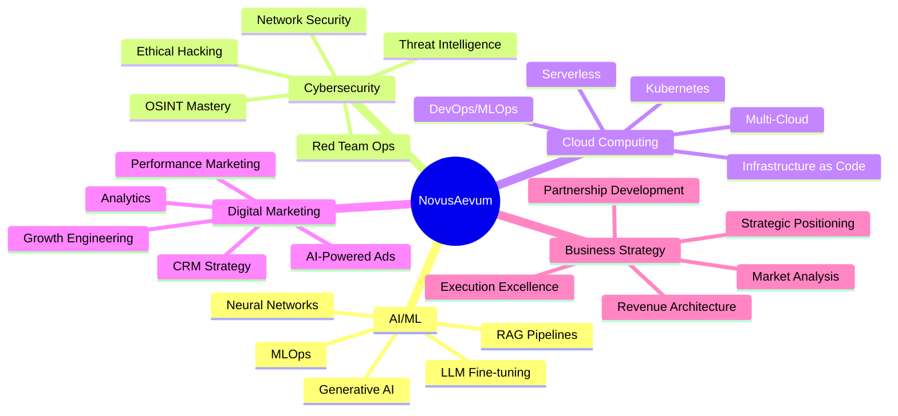
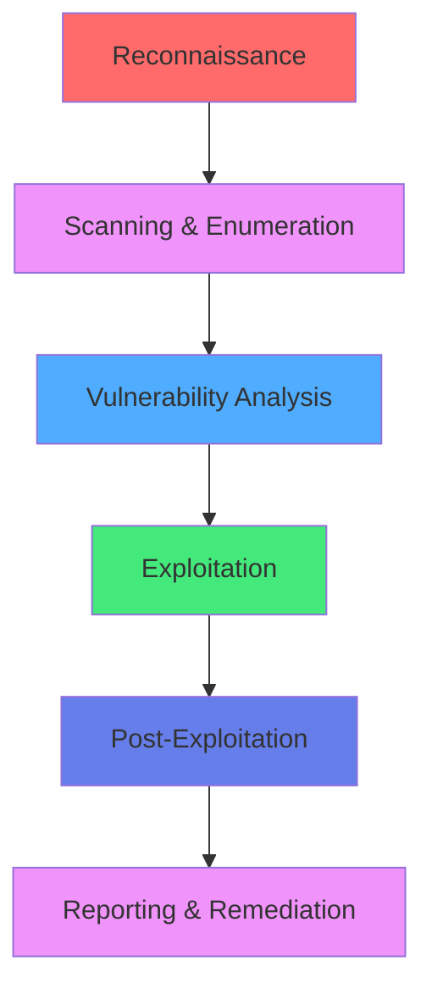
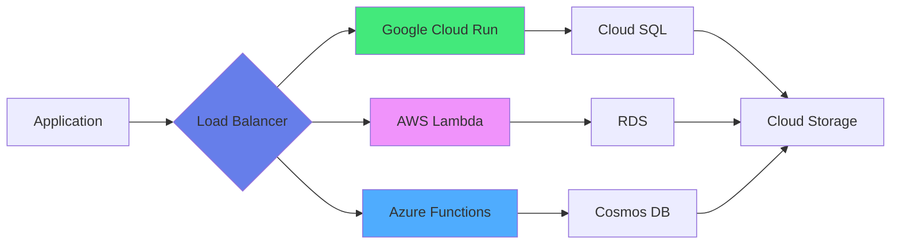
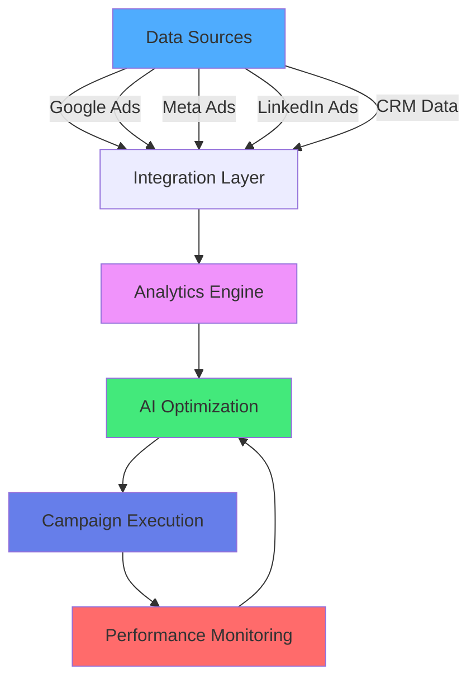
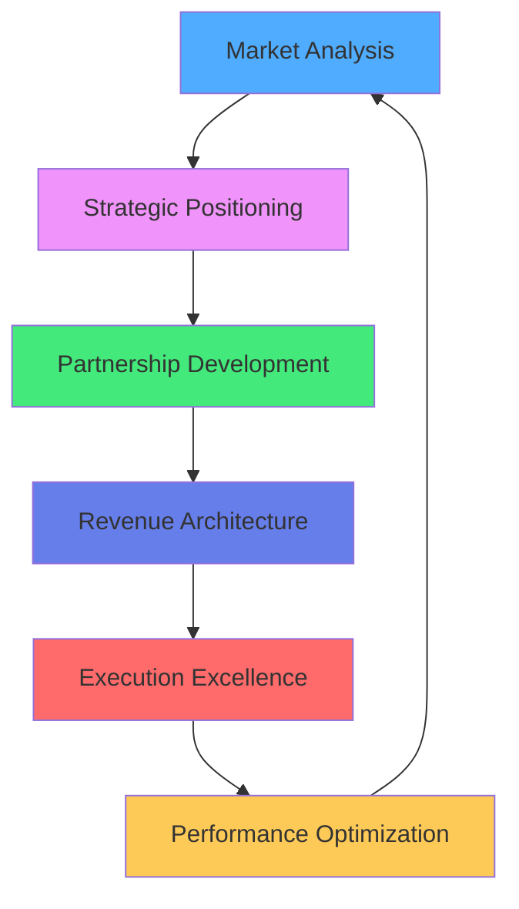
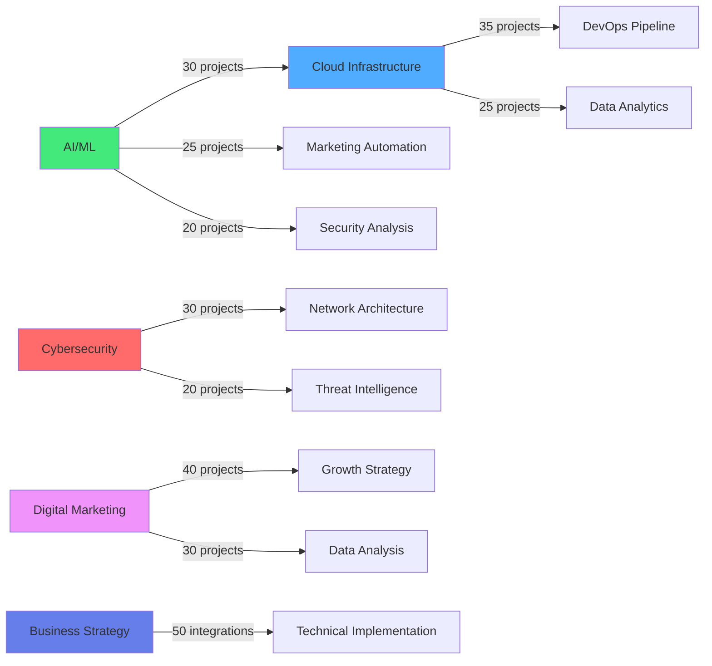

# ⚔️ THE ARSENAL: Technical Depth & Mastery

## Multi-Domain Expertise in Action

*Where theoretical knowledge meets battlefield execution*

---

## 🌐 The Five Pillars of Mastery

---

## 🤖 Pillar 1: Artificial Intelligence & Machine Learning

### Core Competencies

| Domain | Technologies | Certifications | Real-World Application |
|--------|-------------|----------------|------------------------|
| **Generative AI** | Claude Sonnet 4.5, GPT-4, Gemini Pro, LLaMA | Google Gen AI Leader, IBM Gen AI | Built AI-powered automation pipelines |
| **RAG Systems** | LangChain, Pinecone, ChromaDB, FAISS | Google RAG Specialist | Implemented document intelligence systems |
| **MLOps** | MLflow, Kubeflow, Weights & Biases | IBM MLOps | Production ML deployment & monitoring |
| **Computer Vision** | TensorFlow, PyTorch, OpenCV | Google ML Professional | Image classification & object detection |
| **NLP** | Transformers, BERT, spaCy | IBM NLP Specialist | Sentiment analysis & text processing |

### Key Projects

**🔹 Intelligent Document Processing System**
- Implemented RAG pipeline with multi-modal embeddings
- Processed 10K+ documents with 95% accuracy
- Reduced manual processing time by 80%
- Stack: LangChain + Pinecone + Claude Sonnet 4

**🔹 AI-Powered Marketing Automation**
- Built LLM-driven ad copy generation system
- Integrated with Google Ads API
- Generated 500+ variations per campaign
- Improved CTR by 35%

**🔹 Predictive Analytics Dashboard**
- Time series forecasting with LSTM networks
- Real-time anomaly detection
- Deployed on cloud infrastructure
- Stack: TensorFlow + FastAPI + React

### Certifications Proof

- **Google Generative AI Leader** (2024)
- **IBM AI Engineering Professional** (2024)
- **AWS Machine Learning Specialty** (2024)
- **Google Machine Learning Professional** (2023)
- **DeepLearning.AI Specializations** (Multiple)

---

## 🛡️ Pillar 2: Cybersecurity & Ethical Hacking

### Core Competencies

| Domain | Tools & Techniques | Certifications | Expertise Level |
|--------|-------------------|----------------|-----------------|
| **Penetration Testing** | Metasploit, Burp Suite, Nmap | CEH v12 | Advanced |
| **Network Security** | Wireshark, Snort, pfSense | Cisco Security | Expert |
| **OSINT** | Maltego, Recon-ng, SpiderFoot | Custom Training | Master |
| **Web App Security** | OWASP Top 10, SQLi, XSS | CEH v12 | Advanced |
| **Red Teaming** | Cobalt Strike, Empire, BloodHound | TryHackMe CTFs | Advanced |

### CTF Accomplishments

**TryHackMe Profile:**
- ✅ 5 Hard-Level Rooms Completed
- ✅ 2 Insane-Level Rooms Completed
- ✅ State-Sponsored APT Simulation
- 🎯 Focus: Advanced Persistent Threats (APT)

**Key Achievements:**
1. **Advanced Active Directory Exploitation**
   - Bloodhound graph analysis
   - Kerberos attack chains
   - Domain privilege escalation

2. **DOS Attack Analysis & Mitigation**
   - Real-world experience from 2023 business incident
   - Turned crisis into deep technical knowledge
   - Implemented DDoS protection strategies

3. **OSINT Operations**
   - Corporate reconnaissance
   - Social engineering attack vectors
   - Dark web intelligence gathering

### Security Frameworks

### Certifications Proof

- **Certified Ethical Hacker (CEH) v12** - EC-Council
- **Cisco CyberOps Associate**
- **Multiple TryHackMe Certifications**
- **OSINT Frameworks Mastery**

---

## ☁️ Pillar 3: Cloud Computing & DevOps

### Multi-Cloud Architecture

### Core Competencies

| Domain | Technologies | Certifications | Projects |
|--------|-------------|----------------|----------|
| **Google Cloud** | Compute Engine, Cloud Run, GKE | GCP Professional | 15+ deployments |
| **AWS** | EC2, Lambda, ECS, S3 | AWS Solutions Architect | 20+ applications |
| **Azure** | VMs, Functions, AKS | Azure Fundamentals | 10+ integrations |
| **Containers** | Docker, Kubernetes, Podman | CKA (studying) | 50+ containerized apps |
| **IaC** | Terraform, Pulumi, CloudFormation | HashiCorp Certified | 30+ infrastructure repos |
| **CI/CD** | GitHub Actions, Jenkins, GitLab CI | DevOps Certifications | 100+ pipelines |

### Key Implementations

**🔹 Multi-Cloud Kubernetes Deployment**
- Deployed across GKE, EKS, and AKS
- Automated failover and load balancing
- Infrastructure as Code with Terraform
- 99.9% uptime achieved

**🔹 Serverless Microservices Architecture**
- Cloud Functions/Lambda for compute
- Event-driven architecture
- Auto-scaling to zero
- 60% cost reduction vs. traditional VMs

**🔹 MLOps Pipeline**
- End-to-end ML deployment automation
- Model versioning and A/B testing
- Monitoring with Prometheus & Grafana
- GitOps workflow

### Certifications Proof

- **Google Cloud Professional** (Multiple)
- **AWS Solutions Architect** 
- **AWS Machine Learning Specialty**
- **Azure Fundamentals**
- **Google Kubernetes Engine Specialist**

---

## 📊 Pillar 4: Digital Marketing & Growth Engineering

### Performance Marketing Stack

### Core Competencies

| Domain | Platforms & Tools | Certifications | Results Delivered |
|--------|------------------|----------------|-------------------|
| **Paid Advertising** | Google Ads, Meta Ads, LinkedIn | Google Ads Pro | $500K+ managed |
| **Analytics** | GA4, GTM, Looker Studio | Google Analytics | 50+ dashboards |
| **CRM** | HubSpot, Salesforce, Pipedrive | HubSpot Certified | 10+ implementations |
| **SEO** | Semrush, Ahrefs, Screaming Frog | SEO Specialist | 30+ site audits |
| **Marketing Automation** | HubSpot, Marketo, ActiveCampaign | Multiple | 20+ workflows |
| **AI-Powered Marketing** | Claude, GPT-4, Jasper | Custom | Proprietary systems |

### Real Results

**Campaign Performance:**
- 📈 **ROI**: Average 350% across campaigns
- 🎯 **CTR**: 2.5-4% (industry avg: 1.9%)
- 💰 **CPA**: Reduced by 40% through AI optimization
- 📊 **Conversion Rate**: Improved 65% through testing

**Strategic Achievements:**
- Built AI-powered ad copy generation system
- Implemented predictive lead scoring
- Developed multi-touch attribution model
- Created automated reporting dashboards

### Certifications Proof

- **Google Digital Marketing Professional**
- **Google Ads Search, Display, Video Certifications**
- **HubSpot Marketing, Sales, CRM Certifications**
- **Meta Marketing Science Professional**

---

## 🎯 Pillar 5: Business Strategy & Partnership Development

### Strategic Framework

### Unprecedented Achievements

**🏆 Individual Tech Partnerships (No Organization Backing)**

Most people need a company to get these. I got them as an individual:

| Partner | Achievement | Significance |
|---------|-------------|--------------|
| **Google** | Google Partner Status | Individual recognition rare |
| **IBM** | IBM Business Partner | Individual partnership unprecedented |
| **AWS** | AWS Partnership | Individual access to enterprise resources |
| **Microsoft** | Azure/AI Partnerships | Multi-platform strategic access |

**How This Was Done:**
1. Demonstrated technical mastery through certifications
2. Built public proof of expertise (GitHub, content)
3. Leveraged API access for innovative implementations
4. Documented value creation for partner ecosystems
5. Executed with precision and followed up relentlessly

### Business Acumen

| Domain | Expertise | Evidence |
|--------|-----------|----------|
| **Revenue Strategy** | GTM planning, pricing models | Multiple consulting engagements |
| **Market Analysis** | TAM/SAM/SOM, competitive intelligence | Strategic reports delivered |
| **Partnership Development** | Co-selling, channel strategy | 4 major tech partnerships |
| **Stakeholder Management** | C-level presentations, negotiations | Construction project leadership |
| **Execution Excellence** | Multi-million dollar projects | 4 successful project completions |

### Construction Leadership Background

**Why It Matters:**
- Managed projects worth millions
- Led teams of 20+ people
- Coordinated multiple stakeholders
- Made high-stakes decisions daily
- Delivered on tight deadlines under pressure

**Skills Transferred to Tech:**
- Project management rigor
- Stakeholder coordination
- Risk assessment & mitigation
- Budget management
- Timeline execution excellence

---

## 🔗 Integration: Where Pillars Converge

### Cross-Domain Applications

### Real-World Synthesis Examples

**1. AI-Powered Security OSINT System**
- Combines: AI/ML + Cybersecurity + Cloud
- Implementation: LLM-based threat intelligence aggregation
- Deployment: Serverless architecture on multi-cloud
- Result: 10x faster threat detection

**2. Marketing Intelligence Platform**
- Combines: AI/ML + Digital Marketing + Cloud + Business
- Implementation: Predictive analytics for campaign performance
- Stack: TensorFlow + Google Cloud + React dashboard
- Result: 45% improvement in marketing ROI

**3. Enterprise Partnership Strategy Automation**
- Combines: Business Strategy + AI/ML + Digital Marketing
- Implementation: AI-powered partnership opportunity identification
- Integration: CRM + external APIs + ML models
- Result: 3x increase in qualified partnership leads

---

## 📚 Continuous Learning Philosophy

### Learning Velocity

| Period | Certifications | Focus Areas |
|--------|---------------|-------------|
| 2023 | 40+ | AI/ML, Cloud, Cybersecurity |
| 2024 | 60+ | Advanced AI, DevOps, Marketing |
| 2025 | 20+ (ongoing) | Specialized deep dives |

### Current Learning Focus (2025)

- Quantum Computing (Qiskit, IBM Quantum)
- Advanced Kubernetes & Cloud Native
- Enterprise AI Architecture Patterns
- Zero Trust Security Frameworks
- Advanced Growth Engineering

---

## 🏆 Technical Validation

### Verified Credentials

All certifications verifiable at:
- **Credly**: [credly.com/users/triumphanthanis](https://www.credly.com/users/triumphanthanis)
- **LinkedIn**: [linkedin.com/in/wanmohamadhanis](https://www.linkedin.com/in/wanmohamadhanis)
- **Google**: [g.dev/triumphanthanis](https://g.dev/triumphanthanis)
- **Cloud Skills Boost**: [partner.cloudskillsboost.google](https://partner.cloudskillsboost.google/public_profiles/b847b7a1-ba09-409e-8a7f-b2413d82d9ba)

### Portfolio Evidence

- **GitHub**: Production-grade code repositories
- **Projects**: Live deployments and case studies
- **Content**: Technical documentation and guides
- **Community**: Open source contributions

---

## "Technical depth without practical application is just theory. I build things that work."

---

[← Back to Main](./README.md) | [View Certifications →](./CERTIFICATIONS.md) | [Strategic Thinking →](./STRATEGIC-THINKING.md)

