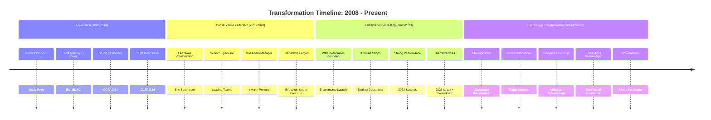
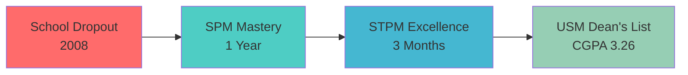
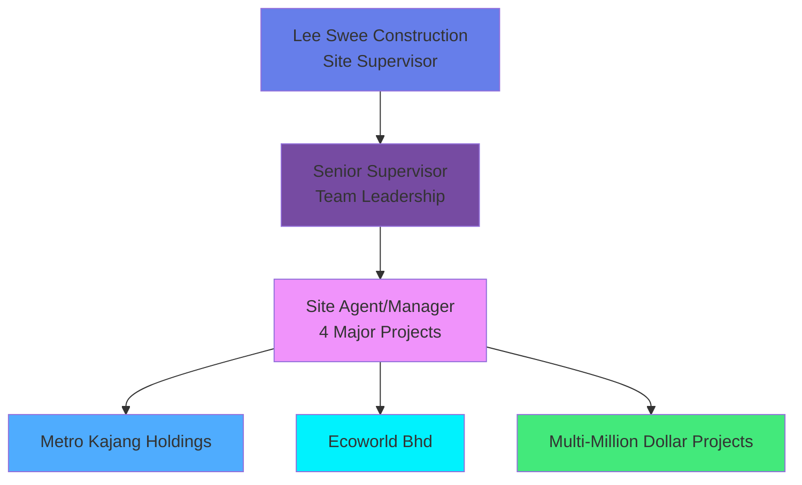
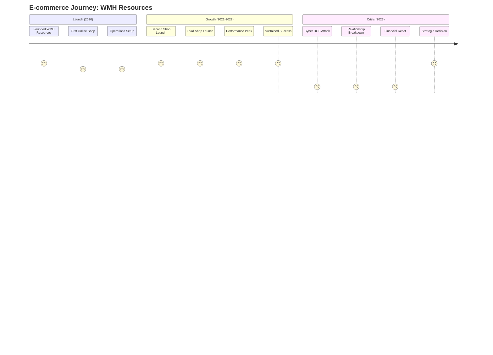
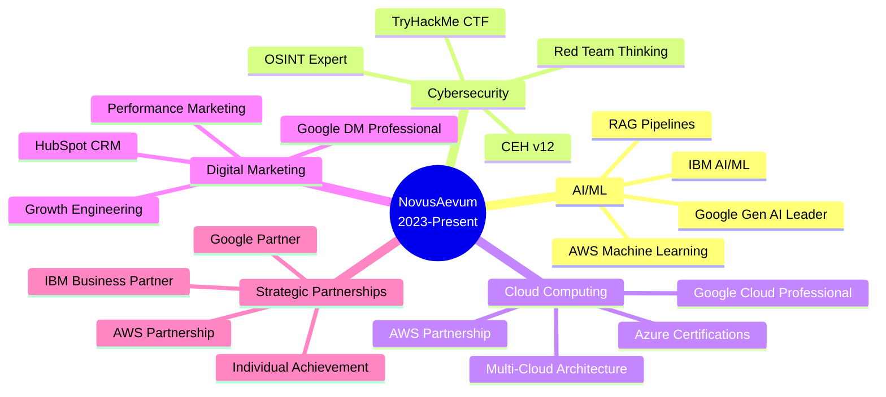
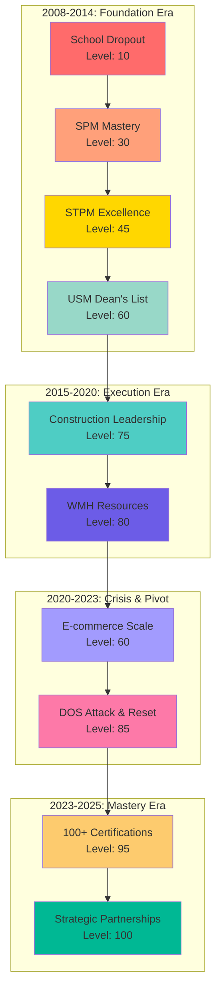
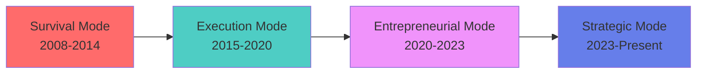

# 🗺️ TIMELINE: The Journey

## From Adversity to Mastery

*A visual journey through transformation*

---

## 🌊 The Complete Journey

---

## 📈 Detailed Phase Breakdown

### Phase 1: Foundation Through Adversity (2008-2014)

**Key Learnings:**
- Failure is data, not destiny
- Learning velocity > credentials
- Resilience is a skill, not a trait
- Every comeback refines the approach

---

### Phase 2: Construction Leadership (2015-2020)

**Skills Developed:**
- Leadership under extreme pressure
- Project management & stakeholder coordination
- Budget management & timeline execution
- Decision-making with incomplete information

---

### Phase 3: Entrepreneurial Testing Ground (2020-2023)

**The 2023 Pivot:**
- Cyber warfare experience → Cybersecurity depth
- Business collapse → Strategic recalibration
- Personal crisis → Philosophical clarity
- **Not a retreat. A calculated pivot.**

---

### Phase 4: Technology Transformation (2023-Present)

**The Acceleration:**
- 100+ certifications in compressed timeframe
- Strategic partnerships without organizational backing
- Transdisciplinary mastery across 5 domains
- **Building capital with no currency**

---

## 🎯 Key Milestones

| Year | Milestone | Impact |
|------|-----------|--------|
| 2008 | School Dropout | Learning to rebuild from nothing |
| 2009 | SPM Mastery (1 year) | 5A, 1B, 4C — Proof of learning velocity |
| 2010 | STPM Excellence (3 months) | CGPA 3.84 — Speed + depth |
| 2011-2014 | USM Dean's List | CGPA 3.26 — Academic validation |
| 2015-2020 | Construction Leadership | 4 major projects, millions in value |
| 2020 | WMH Resources Founded | First entrepreneurial venture |
| 2021-2022 | 3 Shops Scaling | E-commerce success |
| 2023 | The Crisis & Pivot | DOS attack, breakdown, reset, transformation |
| 2023-Present | 100+ Certifications | Rapid mastery across 5 domains |
| 2024 | Strategic Partnerships | Google, IBM, AWS (individual) |
| 2025 | NovusAevum Era | Transdisciplinary strategist fully realized |

---

## 📊 Growth Metrics

### 📈 **Capability Evolution Over Time**

| Year | Overall Mastery | Technical Skills | Strategic Thinking | Business Acumen |
|------|----------------|------------------|-------------------|------------------|
| 2008 | 10% | 5% | 0% | 5% |
| 2010 | 30% | 15% | 5% | 10% |
| 2012 | 45% | 25% | 10% | 10% |
| 2014 | 60% | 35% | 15% | 10% |
| 2016 | 70% | 40% | 20% | 10% |
| 2018 | 75% | 45% | 20% | 10% |
| 2020 | 80% | 50% | 20% | 10% |
| 2022 | 60% | 35% | 15% | 10% |
| 2024 | 85% | 75% | 85% | 80% |
| 2025 | 95% | 90% | 95% | 90% |

**Key Insight:** Notice the dip in 2022 (crisis year), followed by **explosive growth** in 2023-2025 through focused learning and strategic partnerships.

---

## 🌟 What This Journey Taught Me

### 1. Failure is Fuel
Every collapse was a catalyst. Every breakdown was a breakthrough waiting to happen.

### 2. Speed Matters
- SPM in 1 year vs. 2 years: **2x velocity**
- STPM in 3 months vs. 18 months: **6x velocity**
- 100+ certifications in 2 years: **Unprecedented acceleration**

### 3. Resilience is Trainable
It's not about never falling. It's about the **recalibration speed** after impact.

### 4. Play Your Own Game
- Others played poker with luck
- I learned to play chess with strategy
- **Different game, different rules, better outcomes**

---

## 🎭 The Philosophy Evolution

**Current Philosophy:**
- "I build capital with no currency"
- "I play chess in a world built for poker"
- "Precision is my weapon. Clarity is my mandate"

---

## 🚀 What's Next?

The journey continues. The transformation never stops.

Currently exploring intersections where:
- **Innovation** meets meaningful impact
- **Technology** meets human needs
- **Strategy** meets execution
- **Vision** meets reality

---

### "Every scar made my thinking clearer and my actions quieter."

---

[← Back to Main](./README.md) | [The Arsenal →](./TECHNICAL-DEPTH.md)

